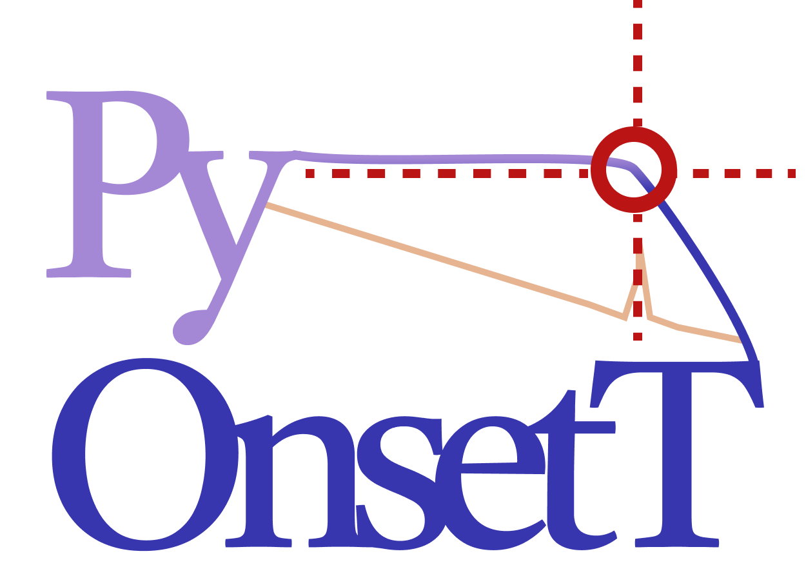

# **PyOnsetT**
::**Py**thon-based **Onset** **T**emperature extractor::


## **Introduction**
**PyOnsetT** is an invaluable tool for obtaining accurate and reliable onset temperatures from raw pressure and temperature data. With this package, users can measure onset temperatures with greater precision and accuracy than ever before. Additionally, the package is designed to be cross-platform, meaning that it can be used with a variety of data acquisition apparatuses, such as high-pressure autoclave, high-pressure rocking cell, and high-pressure micro-differential scanning calorimeter. For gas hydrate researchers, PyOnsetT provides a convenient and user-friendly interface for accurately measuring the onset temperature of gas hydrate samples.

### **What are gas hydrates?**
Gas hydrates are a special type of ice-like substance that form when gas molecules are trapped in an environment of low temperature and high pressure. This type of environment is typically found in deep-sea environments, permafrost, and other cold, isolated areas of the Earth. 

### **Gas hydrate formation inside the oil and gas pipeline**
When transporting oil and gas through pipelines, it is important to understand the potential for gas hydrate formation. During the transportation process, the temperature of the pipeline can decrease and pressure increase, creating an environment that is conducive to gas hydrate formation. As the temperature of the pipeline decreases, the solubility of gas decreases, resulting in gas molecules being trapped in an environment of high pressure and low temperature. As a result, gas hydrates may form and accumulate in the pipeline, leading to blockages and reduced flow. One way to mitigate the gas hydrate formation is to utilize chemicals called gas hydrate inhibitors. Researchers in many laboratories are already evaluating potential gas hydrate inhibitors and working towards finding the most effective ones. This is done by measuring the onset temperature of the hydrate formation, which can be used to compare and evaluate various inhibitor candidates. With PyOnsetT, researchers can rapidly analyze the onset temperature data of gas hydrates and determine which inhibitor candidates are most effective.

## **Prerequisites**
- `Python 3.8` or higher
- `Numpy`
- `Pandas`
- `Matplotlib`
- `Ruptures`
- `Shutil`
- `Tabulate`

## **Installation**
You can easily download the PyOnsetT from [pip](https://pip.pypa.io/en/stable/).
```
$ pip install pyonsett
```

## **Usage**
To use PyOnsetT, first open the terminal and type the following command:
```
$ pyonsett [option] [value]
```
### **Optional arguments**
PyOnsetT allows users to customize their usage through command-line arguments. The available options are:
| Option | Description | Default value |
| --- | --- | --- |
| `-ps` or `--pnum` | Pressure sensor number (1 or 2) | 1 |
| `-ts` or `--tnum` | Temperature sensor number (1, 2, 3, or 4) | 1 |
| `-d` or `--dirloc` | Directory location of the csv files | `./` |
| `-r` or `--range` | The range detecting the onset of the temperature change near the rupture [Unit: steps] | 50 |
| `-pi` or `--pinit` | The minimum pressure value during the onset temperature measurements [Unit: bar] | 20 |
| `-pf` or `--pfinal` | The maximum pressure value during the onset temperature measurements [Unit: bar] | 34 |
| `-v` or `--version` | Show the version of PyOnsetT | 1.X.X |

## **Output**
PyOnsetT will generate a zip folder named `[file_name].zip` containing the following files:
- `DATA1_obtained+onset+temperatures.csv`: A CSV file containing the obtained onset temperatures
- `PLOT1_P&T-time.png`: A plot of the pressure and temperature over time
- `PLOT2_P&T-time_with_change_points.png`: A plot of the pressure and temperature over time with the change points marked
- `PLOT3_Exact_onset_temperatures_with_the_change_point.png`: A plot of the exact onset temperatures with the change points marked (enlarged)

## **Features**
- Extracts onset temperatures from a given data file
- Easily downloadable via pip
- Generates a `zip` folder with CSV, and 3 plots (PNG)
- Allows for changes in the range of onset temperatures
- Open source and freely available

## **Contributing**
Pull requests are welcome. For major changes, please open an issue first to discuss what you would like to change.

## **Author**
- [wjgoarxiv](https://github.com/wjgoarxiv)

## **License**
PyOnsetT is released under the MIT License.
